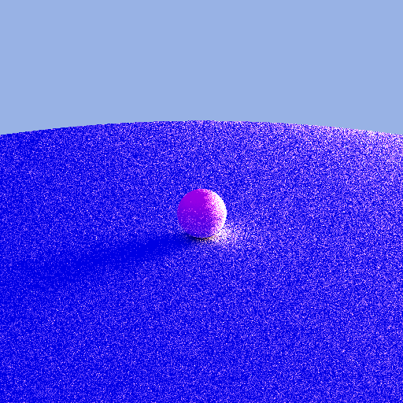
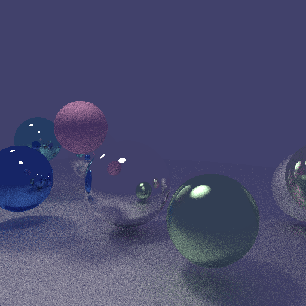

# Hoshizora (星空) — Physically Based Renderer

A from-scratch, GPU-accelerated physically-based rendering engine built in C++ and Vulkan compute shaders as a personal learning project.

> **Hoshizora (星空):** It means *Starry Sky* in Japanese. A physical metaphor for a blank canvas catching millions of simulated rays, tracing the path of light through a synthetic universe.

## Examples

<p align="center">
  
  
</p>
<p align="center">
  
</p>

## Overview

This project implements a GPU-accelerated path tracer using Vulkan compute shaders, capable of rendering scenes with realistic lighting and materials. It features:

- **GPU-accelerated path tracing** via Vulkan compute shaders
- **Physically-based rendering** with metallic/roughness workflow
- **Global illumination** through path tracing
- **Material system** supporting albedo, roughness, metallic, and emissive properties
- **Multi-sample anti-aliasing** for noise reduction
- **Animation support** for camera movement sequences

## Technical Details

- **Language**: C++20
- **GPU API**: Vulkan (compute shaders)
- **GPU memory**: Vulkan Memory Allocator (VMA)
- **Shading language**: GLSL
- **Math library**: GLM
- **Image output**: STB Image Write
- **Build system**: CMake

## Future Goals

- **Enhanced material models** for more realistic surfaces
- **Scene file format** for easier scene configuration
- **Real-time preview** capabilities

## Building

```bash
# Clone with submodules
git clone --recursive https://github.com/pablobh2147/hoshizora

# Build
cmake -B build
cmake --build build

# Run
./build/Hoshizora < examples/scene.props
```
